# Les Fondements Des Microservices
---
Auteur: CAMARA Laby Damaro  
--
Développeur Full Stack &amp; netpreneur
--
Ressource: [LinkedLearning](https://www.linkedin.com/learning/les-fondements-des-microservices/conclure-sur-les-fondements-des-microservices)
--
&ldquo;Ma Promesse est le sommeil &amp; la mort&rdquo;
---
## Résumé De La Formation
Les microservices font partie des modèles architecturaux de référence dans le secteur des logiciels. Il est essentiel d’avoir une vue d’ensemble de ce qu’est cette architecture et de ce qu’elle n’est pas pour se lancer dans l’évaluation de ce modèle. Cette formation couvre les concepts de base des microservices, afin de vous aider à déterminer si ce modèle architectural vous convient, à vous et à votre équipe. Par la suite, elle vous aide à vous familiariser avec certains concepts clés des microservices, y compris la délimitation des contextes et la couche d’API. elle évoque aussi certains des aspects plus avancés de l’architecture, tout en insistant sur l’importance d’adopter une culture DevOps pour migrer vers les microservices.

## Programme De La Formation
### Aperçu Historique Des Microservices

### Concepts Clés Des Microservices

### Concepts Avancés

### Choix En Matière D'Architecture

## Etablir Les Prérequis
### Managers
Que vous soyez managers ou décideurs dans le cycle de vie d'une équipe de développement logiciel, nous allons dans cette formation:

### Architectes
Si vous êtes architectes cette formation constituera un excellent point de départ et vous permettra d'acquérir des bases solide  pour prendre des décisions:

### Développeurs
Si vous êtes développeurs, cette formation vous donnera de très bonnes bases pour expliquer pourquoi vous codez comme vous le faits:

Pour suivre cette formation:
* il faut simplement avoir envie d'apprendre 
* connaître les base du développement logiciel
* en tant que développeur ou architectes, vous devez connaître la composition et la décomposition logiciel
* vous devez comprendre les principes de la communication à distance via le protocole **HTTP** et **HTTPS** afin de cerner certaines des complexités des architectures **microservices**

## Explorer L'Historique Des Architectures Basées Sur Les Services
### Architecture Monolithique
Avec les architectures monolithique, il faut créer un artefact constitué en trois (3) couches en générales(Présentation, Processus métier, Accès aux données), souvent chaque couche se décompose en des sous couches par exemple pour la couche **accès aux données**(Façade, traitement, Entrée-sortie), cela permet de séparer le problème et de décomposer le code en composant fonctionnel. Autre que ces problème avec les applications monolithiques il y a un problème de couplage fort, leurs conceptions prennent assez de temps et le test peut paraître parfois trop pénible.

### Architecture De Service
Puis nous avons aussi l'avènement des architectures de service notamment des architectures orientées services(SOA) qui permettent de décomposer  les applications en plus petits modules mais génèrent des nouveaux problèmes la technologie de service web repose sur le protocole SOAP ce qui provoque de nouveaux problèmes, chaque réponse est 200(OK) ou 500(Erreur interne) en plus le problème de couche agrégation car les transformation du XML et les opérations logiques étaient rajoutées aux **Bus SOA** cela crée un nouveau niveau de couplage cependant la **SOA** s'était imposée à un moment donnée de l'histoire.

### Microservices
Les microservices offrent un Framework plus agile qui peut être étendu dans un environnement Cloud Natif beaucoup plus facilement que les applications  monolithique  ou SOA.
Ce modèle convient mieux aux développeur web et aux développeurs des services web car ils reposent sur le protocole **HTTP**
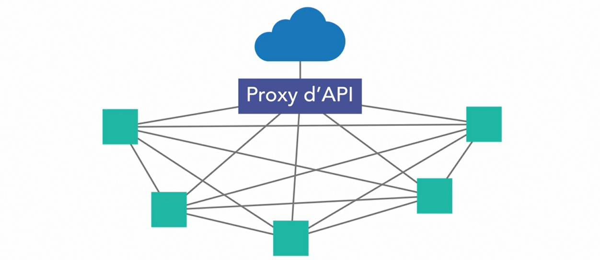

## Microservices
### Définition
Les microservices constituent la décomposition d'un problème logiciel en plus petits problèmes, plus facile à comprendre et à résoudre, mais ils servent aussi à faire en sorte que l'architecture au niveau des composants fonctionne de la même manière que les bonnes pratiques de développement avec la modularisation du code. Face un problème logiciel, nous savons qu'il faut décomposer le problème en plus petits problèmes pour résoudre chacun de ces problèmes de façon modulaire et découplé. Les microservices reprennent ce problèmes et l'appliquent à l'ensemble du système. 

Les microservices utilisent l'interopérabilité hétérogène basée sur l'adaptation au protocole pour gérer les comminucations ainsi:

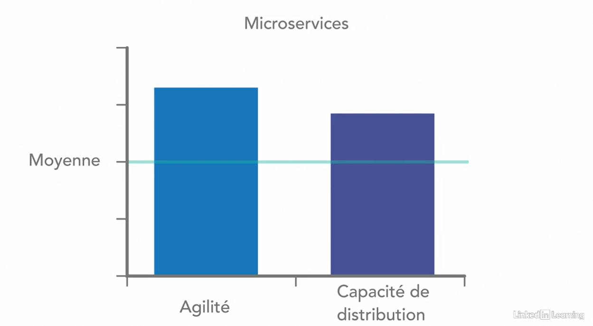

## Distinguer Microservice Et Cloud Natif
### Architecture Cloud Natif
Les architectures Cloud Natifs réposent sur la méthodologie de création d'application à 12 facteurs.
Les architectures cloud natifs incluent des modèles pour créer des systèmes s'exécutant dans une infrastructure cloud.
#### Infrastructure Cloud 
les infrastructure cloud peuvent être:

Le cloud computing est un modèle de système distribuer à l'echelle mondiale qui maximise la disponibilité, évolutivité et distribution. Nous pouvons créer des systèmes cloud s'exécutant dans un seul data center et prévoir de les étendre.
Les microservices s'intègrent très bien trop souvent dans une architecture cloud natif car ils constituent une transition très fluide vers une application à 12 facteurs. ils sont deux facteurs très différents.
Nous pouvons créer des applications cloud monolithique et des application microservices incapables de migrer dans le cloud. Trop souvent les gens confondent les deux modèles.
Mais malgré leurs différences ces deux modèles vont souvent de pairs

### Applications De Microservices Cloud Natives

## Différencier Les Services
Avec les microservices toutes les comminucations entre les services fonctionnent avec le REST à l'aide du protocole HTTP, il y a d'autre méthode base sur  la notion d'évènement, mais les appels intra-service repose tous sur  le REST.

### Service
Avec les microservices, un service fonctionne sur un domaine bien défini, les opérations sont définis sur  le domaine et non sur les objets métiers. 
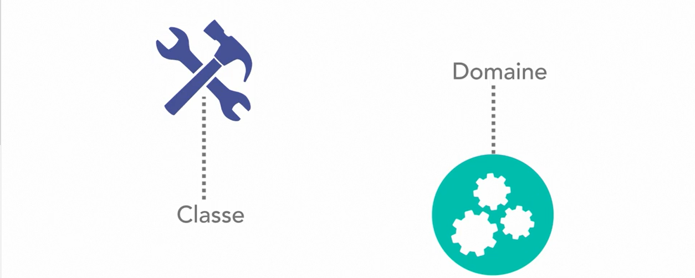
Dans une architecture de microservice il faut fournir des services de très bon niveaux, souvent ses services exposent des opérations GRUD spécifique à un domaine sur l'objet de domaine, mais ce domaine peut couvrir plusieurs domaines.

### Blocage De Conception De Service

## Aborder La Danse De La Communication
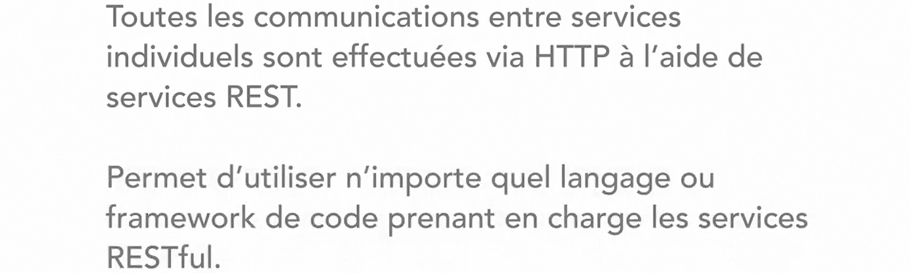
### Interopérabilité Hétérogène Basée Sur L'Adaptation Aux Protocoles

### Avantages

### Problème

### Solution 
Chaque service doit maintenir un certain niveau de passivité dans ces API pour éviter les défaillances dans ces systèmes, un service pouvant appeler n'import lequel de ces services, il n'y a pas de delimitation claire qui vous appelle, nous devons avoir une solide stratégie de gestion de version de API passive pour que les système d'appelles ne tombent pas en panne lors de la publication d'une nouvelle version d'API.
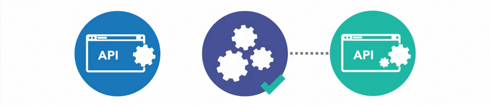

## Examiner La Distribution Et L'Evolutivité
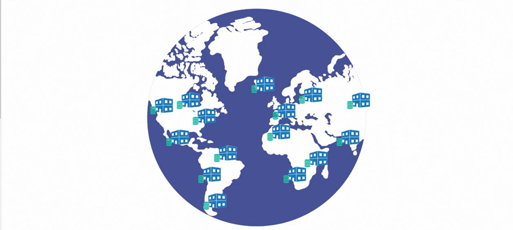
### Besoins Liés A Internet Du Point De Vue De L'Entreprise

### Avantage
* évolutivité 
* distribution
* scalabilité

## Anticiper Les Danger De La Latence  Et L'Engorgement
### La Latence
La latence peut devenir intolérable dans une architecture microservice
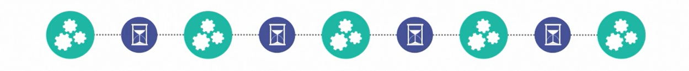

### Appels Circulaire
Les appels circulaire peuvent devenir problématiques.
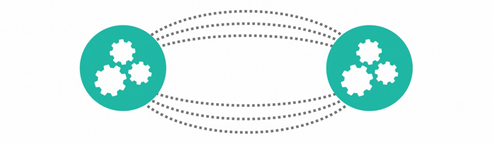
Avant de passer à une architecture nous devons penser aux problèmes de latence.
## Définir Le Contexte Délimité
### Modèle De Conception

## Observer Les Limites Des Domaines De Données
### Limites Transactionnelles

Si vous travaillez sur une couche d'API
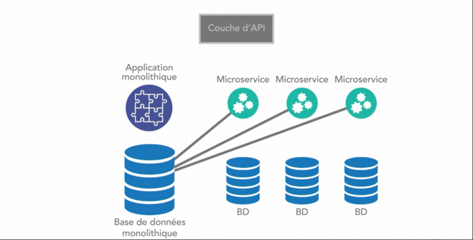

## Découvrir Les Pertes Des Transactions Atomiques

Dans une architecture monolithique ces opérations bien respectés par contre dans une architecture microservice, ces opérations sont presque inexistantes à la place: 

Mais il y a des moment où nous avons réellement besoins des transactions ACID par exemple pour les applications bancaire où les débits et les crédits doivent se produire dans une seule transaction bancaire.
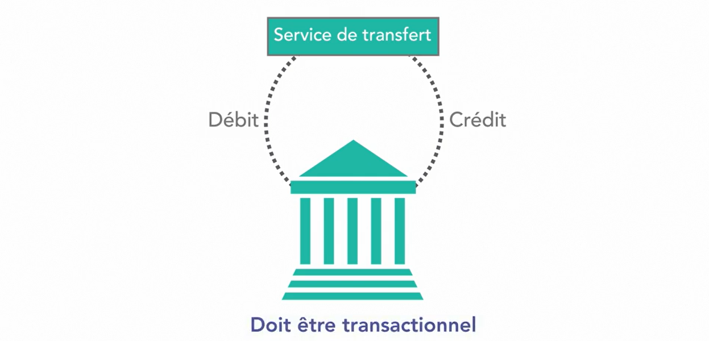

## Etudier La Couche API
La couche API est un proxi agréger toutes nos offres de service

## Aborder Les Communication Asynchrones

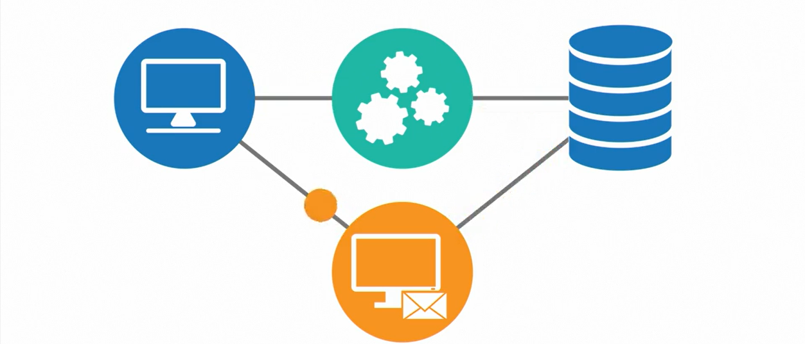
## Enregistrer Et Tracer Dans Une Architecture De Microservices

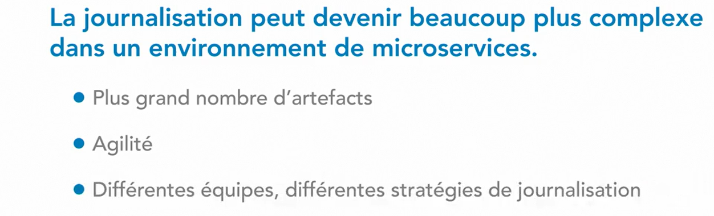
Le traçage consiste à créer un jeton unique appeler trace à utiliser cette trace dans tous les évènements de journalisation interne cette pile d'appelle en intégrant cette valeur à tous les résultats de journalisation et  de minutage pour tous les services concernés pour faciliter la journalisation.

## Comprendre L'Importance De La Livraison Livraison Continue 
### Livraison Continue

### CI/CD

#### CD Hors Production

#### CD Production
Une fois l'artefact valider, il sera déployer automatiquement

## Connaître Quelques Architectures Hybrides Viables
### Architecture Hybride De Service

#### Architecture N-tiers Hybrides
Dans le modèle hiérarchique n-tiers, nous pouvons définir différentes classes de services:
* le service de données est une classe commune qui expose la logique des données spécifique au domaine au monde extérieur
* le service des processus métier constitue une autre classe commune qui définie précisément des processus métiers de haut niveau
* nous pouvons également définir des services de passerelles qui créent des abstractions vers des dépendances externes
* et enfin nous pouvons définir des services Edge qui exposent nos données et nos processus métiers aux monde extérieurs 
* une fois que nous avons une taxonomie claire, nous pouvons définir des règles sur ce que les services peuvent consommer, étudier les risques liés aux appels circulaires et interdire qu'un service appel aucun autre service de donnée sans être impliqué dans un processus métier. La consommation de service de passerelle intervient aussi via les même processus métier et non entre eux.

### Architecture De Services

## Parcourir Les Considérations Relatives A La Conception
Pour concevoir une architecture microservice voici quelques points essentiels à tenir compte:

* Concernant le code nous devons envisager de tirer parti de la conception piloter le domaine
* nous devons effectuer une véritable analyse de l'ensemble du système et utiliser ces connaissances pour développer nos services
* nous devons réfléchir à la création de nos services et à la fonction qu'ils vont exécuter
* nous devons également penser si nous allons exploiter des services de données dédier ou intégrer les données dans les processus métiers
* devrions-nous intégrer les services ensembles pour obtenir les transactions avec leur propriétés ACID là où cela est requis ou devrions-nous élaborer des stratégie basée sur la cohérence éventuelle des données

### Conception Des Mécanismes Pour Contrôler La Latence

Beaucoup de développeur n'aime entendre la standardisation, mais les équipes qui réussent le mieux avec les architectures de microservices ont opté pour la standardisation.
La standardisation permet de déplacer les ressources plus facilement en fonction de l'évolution des besoins métiers, de plus au départ concevons nos systèmes de manière asynchrone. Essayons de créer chaque service avec des opérations asynchrones jusqu'à ce qu'il soit approuvé que nous en avons besoins des opérations synchrones.

## Discerner Les Compromis
### Payer La &lt;&lt;Distribution Tax &gt;&gt; Offre Plusieurs Avantages

Prenons le cas d'amazone qui opère à l'échelle mondiale et qui clairement atteint une pic d'activité à la veille de la fête de paque il serait quasiment impossible pour elle de gérer son système dans le cadre d'un déploiement monolithique. Elle gère la **distribution tax** modèle hautement disponible qui constitue un avantage évident pour opérer à l'échelle mondiale.

### Problèmes Liés A La Complexité

### Pratiques De Développement Polyglotte

Le développement polyglotte s'accompagne avec une complication de la gestion des service en production.

## Voir Les Avantages Des Services De Pointe

### Services Edge Sortants

### Services Edge Entrantes / De Traduction

#### Avantages D'un service Edge

## Adopter Une Culture DevOps

### Automatisation Des Tâches

### Version de codes Et Gestion Automatique

## Notions Aborder Dans cette Formation

